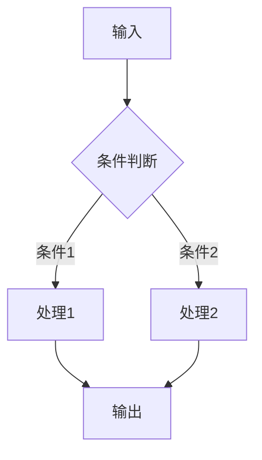

# Explain Code — 代码解读技能

深度分析代码，帮助快速理解代码的设计意图和执行逻辑。


## Goal

深度分析代码，包含核心功能、架构设计、执行流程、依赖关系、代码质量评估

## Trigger

- 用户要求"解释代码"、"分析代码"、"代码走读"
  - 新人入职需要理解项目代码
  - 代码评审前需要理解设计意图

## 工作流程

```
代码输入 → 范围检测 → 结构分析 → 逻辑梳理 → 依赖映射 → 质量评估 → 输出报告
```

### Step 1: 范围检测与语言识别
- 检测文件扩展名、package.json、requirements.txt 等
- 确定语言版本和框架版本
- 判断输入范围：单文件 / 模块(目录) / 完整项目
- 根据范围和用户意图选择分析深度（见决策矩阵）

### Step 2: 结构分析
- 入口点识别（main、__init__、index）
- 模块划分和依赖关系映射
- 设计模式识别

### Step 3: 逐层深入
- 调用链追踪（从入口到叶子函数）
- 数据流分析（输入→处理→输出）
- 控制流分析（条件分支、循环、异常处理）
- 并发模型（线程、协程、事件循环）

### Step 4: 质量评估
- 代码质量评分（可读性/可维护性/健壮性/性能/安全性）
- 潜在风险识别
- 改进建议

### Step 5: 输出报告
- 选择输出格式（简洁版/详细版）
- 生成分析报告

## 分析维度

### 1. 核心功能分析

| 分析项 | 内容 |
|--------|------|
| 入口点 | 程序从哪里开始执行 |
| 核心职责 | 这段代码的主要功能是什么 |
| 输入输出 | 接收什么数据，产出什么结果 |
| 业务价值 | 解决了什么问题 |

### 2. 架构设计分析

| 分析项 | 内容 |
|--------|------|
| 设计模式 | 使用了什么设计模式（工厂、策略、观察者等） |
| 模块划分 | 代码如何组织，模块间如何协作 |
| 分层结构 | 是否遵循分层架构（Controller/Service/Repository） |
| 扩展性 | 设计是否便于扩展 |

### 3. 执行流程分析

```
主流程:
输入 → 处理步骤1 → 处理步骤2 → ... → 输出

分支流程:
条件A → 分支1处理
条件B → 分支2处理
条件C → 分支3处理

异常流程:
异常类型1 → 处理方式1
异常类型2 → 处理方式2
```

### 4. 依赖关系分析

```
当前模块
├── 依赖模块A (import)
│   ├── 使用函数: func1, func2
│   └── 使用类: ClassA
├── 依赖模块B (import)
│   └── 使用常量: CONST_X
├── 外部依赖 (pip/npm)
│   ├── requests: HTTP 调用
│   └── sqlalchemy: 数据库操作
└── 被依赖 (被谁调用)
    ├── 模块X 调用 current_func1
    └── 模块Y 调用 current_func2
```

### 5. 代码质量评估

| 维度 | 评估标准 | 评分 |
|------|----------|------|
| 可读性 | 命名清晰、注释充分、结构清晰 | 1-5 |
| 可维护性 | 模块化、低耦合、单一职责 | 1-5 |
| 健壮性 | 错误处理完整、边界检查 | 1-5 |
| 性能 | 算法效率、资源使用 | 1-5 |
| 安全性 | 输入验证、权限检查 | 1-5 |

## 分析深度决策矩阵

根据输入范围和用户意图，选择合适的分析深度和输出格式。

| 输入范围 | 代码行数 | 用户意图 | 分析深度 | 输出格式 |
|---------|---------|---------|---------|---------|
| 单文件 | < 200行 | 快速理解 | 轻量（流程+关键函数） | 简洁版 |
| 单文件 | < 200行 | 代码审查 | 标准（全维度评估） | 详细版 |
| 单文件 | 200-1000行 | 快速理解 | 标准（分模块分析） | 简洁版 |
| 单文件 | 200-1000行 | 代码审查 | 深入（含质量评分） | 详细版 |
| 模块(目录) | < 5000行 | 快速理解 | 标准（模块关系图） | 简洁版 |
| 模块(目录) | < 5000行 | 架构理解 | 深入（架构+依赖分析） | 详细版 |
| 模块(目录) | 5000-10000行 | 快速理解 | 标准（目录结构+入口） | 简洁版 |
| 完整项目 | > 10000行 | 快速理解 | 轻量（仅目录结构+入口点） | 简洁版 |
| 完整项目 | > 10000行 | 架构理解 | 深入（逐模块分析） | 详细版 |

## 分析方法选择表

根据用户问题类型，选择最合适的分析方法。

| 用户问题类型 | 推荐方法 | 分析重点 | 适用场景 |
|-------------|---------|---------|---------|
| "这段代码做什么？" | 数据流分析 | 输入→处理→输出全链路 | 理解业务逻辑 |
| "代码怎么执行的？" | 控制流分析 | 条件分支、循环、异常路径 | 理解执行流程 |
| "函数A调用了谁？" | 调用链追踪 | 从入口到叶子的完整调用链 | 理解模块关系 |
| "有什么设计模式？" | 结构分析 | 模块划分、类继承、接口实现 | 架构理解 |
| "有没有性能问题？" | 数据流+复杂度 | 循环嵌套、资源分配、IO操作 | 性能优化 |
| "安全吗？" | 数据流+控制流 | 输入验证、权限检查、敏感数据 | 安全审查 |
| "为什么这里会报错？" | 控制流+异常分析 | 异常路径、边界条件、空值处理 | 问题定位 |

## 输出格式

### 简洁版（快速理解）

```markdown
# 代码解读: {文件/模块名称}

## 一句话总结
{这段代码做什么}

## 核心功能
- {功能1}
- {功能2}

## 执行流程
1. {步骤1}
2. {步骤2}
3. {步骤3}

## 关键代码
```python
# 最核心的代码段
{代码}
```

## 注意事项
- {需要注意的点}
```

### 详细版（深入分析）

```markdown
# 代码深度分析报告

## 一、概述
- **文件**: {file_path}
- **语言**: {language}
- **行数**: {lines}
- **职责**: {一句话描述}

## 二、架构设计

### 2.1 整体结构
{ASCII 架构图或描述}

### 2.2 设计模式
- 使用了 {模式名称} 模式
- 用途: {为什么使用这个模式}

### 2.3 模块依赖
{依赖关系图}

## 三、执行流程

### 3.1 主流程


### 3.2 关键函数

#### 函数1: {function_name}
- **参数**: {参数说明}
- **返回值**: {返回值说明}
- **逻辑**: {函数做了什么}
- **复杂度**: O({n})

## 四、代码质量

### 4.1 优点
- ✅ {优点1}
- ✅ {优点2}

### 4.2 改进建议
- ⚠️ {建议1}
- ⚠️ {建议2}

### 4.3 潜在风险
- 🔴 {风险1}
- 🟡 {风险2}

## 五、使用示例
```python
# 如何使用这段代码
{示例代码}
```

## 六、相关代码
- {相关文件1}: {关系说明}
- {相关文件2}: {关系说明}
```

## 分析技巧

### 1. 自顶向下分析
```
1. 先看整体结构（目录、文件组织）
2. 找入口点（main、__init__、index）
3. 理解核心流程
4. 分析辅助函数
5. 查看配置和常量
```

### 2. 数据流追踪
```
1. 数据从哪里来（输入、数据库、API）
2. 经过什么处理（转换、计算、验证）
3. 最终到哪里去（输出、存储、展示）
```

### 3. 控制流分析
```
1. 条件分支（if/else、switch）
2. 循环逻辑（for、while）
3. 异常处理（try/catch）
4. 回调和异步
```

## Edge Cases

- **混淆/压缩代码**
  - IF 代码被混淆且用户需要完整分析 THEN: 提示用户提供可读版本
  - IF 无法获取可读版本 THEN: 退化为接口分析——仅分析函数签名、导出接口、调用关系
  - IF 代码被压缩(minified) THEN: 先格式化（prettier/js-beautify），再执行标准流程

- **未知语言/框架**
  - IF 语言无法自动识别 THEN: 基于语法特征推断（缩进风格、关键字、注释格式）
  - IF 推断置信度 < 60% THEN: 明确标注"语言识别不确定"，仅做通用分析
  - IF 框架未知 THEN: 分析 import/require 语句，从依赖名推断框架类型

- **超大代码库（>1万行）**
  - IF 代码 > 1万行 AND < 10万行 THEN: 先分析目录结构和入口点，再逐模块深入（每个模块独立分析）
  - IF 代码 > 10万行 THEN: 仅分析目录结构 + 入口文件 + 核心模块，跳过辅助/工具代码
  - IF 用户指定具体文件 THEN: 按单文件流程处理，但标注该文件在项目中的位置

- **缺少上下文**
  - IF 注释不足且用户需要理解业务 THEN: 询问用户关键业务逻辑和术语含义
  - IF 上下文不足以判断设计意图 THEN: 列出多种可能的解释，让用户确认
  - IF 代码引用了未提供的依赖 THEN: 仅分析当前代码逻辑，标注"依赖 {name} 未提供"

- **多语言项目**
  - IF 项目包含多种语言 THEN: 按语言分别分析，最后生成跨语言架构视图
  - IF 语言间有 FFI/IPC 调用 THEN: 重点分析接口边界的数据转换
  - IF 用户仅关心某一语言 THEN: 仅分析该语言部分，标注其他语言的存在

- **动态代码/元编程**
  - IF 代码大量使用反射/eval/动态导入 THEN: 标注"存在动态行为，静态分析可能不完整"
  - IF 使用宏/装饰器/代码生成 THEN: 先展开宏/装饰器，再分析展开后的代码

## 不适用

**范围边界：** 本技能分析和解读已有代码，不生成新代码、不执行自动重构、不进行自动化安全扫描。分析结果为理解代码服务，不直接修改代码。

- 自动化代码重构 → 使用 wo-yao-yan-pai（迭代式代码审查）
- 安全漏洞扫描 → 使用 [security-scan](../security-scan/SKILL.md)
- 代码风格检查 → 使用 linter 工具

### 适用场景矩阵

| 用户意图 | 推荐分析深度 | 推荐输出格式 | 推荐分析方法 |
|---------|-------------|-------------|-------------|
| 快速理解代码 | 轻量 | 简洁版 | 数据流分析 |
| 代码审查 | 深入 | 详细版 | 全维度评估 |
| 新人入职学习 | 标准 | 详细版 | 结构分析 + 调用链追踪 |
| 问题定位/调试 | 标准 | 简洁版 | 控制流分析 + 异常路径 |
| 架构理解 | 深入 | 详细版 | 结构分析 + 依赖映射 |
| 设计意图理解 | 标准 | 详细版 | 调用链追踪 + 设计模式识别 |
| 文档编写参考 | 标准 | 详细版 | 全维度分析 |

## 快速使用

```
# 解释单个文件
解释这个文件的作用和逻辑

# 解释函数
这个函数是做什么的？参数是什么意思？

# 分析整个项目
分析这个项目的架构和核心模块

# 代码走读
带我走读这段代码的执行流程

# 设计分析
这段代码用了什么设计模式？为什么这样设计？
```

## 参考资料

- 设计模式参考: [references/design-patterns.md](references/design-patterns.md)
- 代码质量标准: [references/quality-metrics.md](references/quality-metrics.md)
