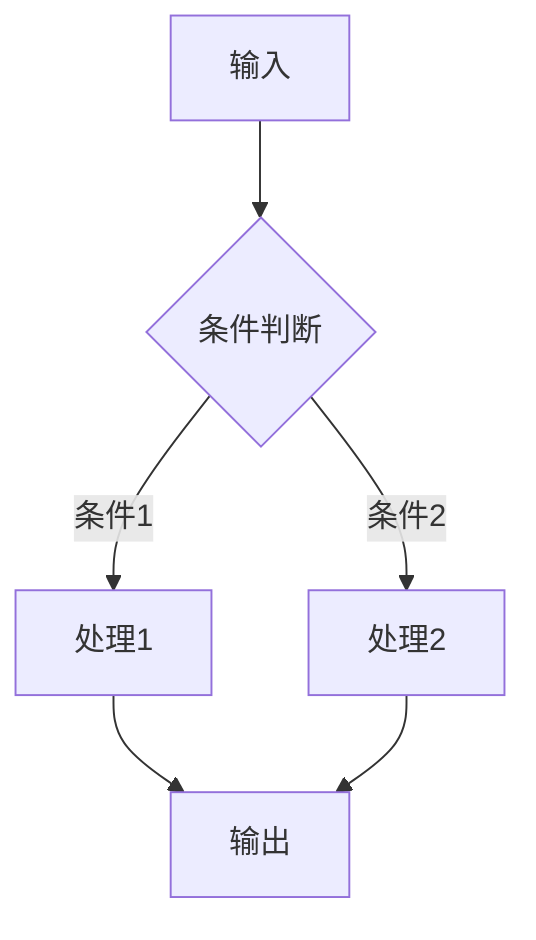

# Explain Code — 代码解读技能

深度分析代码，帮助快速理解代码的设计意图和执行逻辑。

## 工作流程

```
代码输入 → 结构分析 → 逻辑梳理 → 依赖映射 → 质量评估 → 输出报告
```

## 分析维度

### 1. 核心功能分析

| 分析项 | 内容 |
|--------|------|
| 入口点 | 程序从哪里开始执行 |
| 核心职责 | 这段代码的主要功能是什么 |
| 输入输出 | 接收什么数据，产出什么结果 |
| 业务价值 | 解决了什么问题 |

### 2. 架构设计分析

| 分析项 | 内容 |
|--------|------|
| 设计模式 | 使用了什么设计模式（工厂、策略、观察者等） |
| 模块划分 | 代码如何组织，模块间如何协作 |
| 分层结构 | 是否遵循分层架构（Controller/Service/Repository） |
| 扩展性 | 设计是否便于扩展 |

### 3. 执行流程分析

```
主流程:
输入 → 处理步骤1 → 处理步骤2 → ... → 输出

分支流程:
条件A → 分支1处理
条件B → 分支2处理
条件C → 分支3处理

异常流程:
异常类型1 → 处理方式1
异常类型2 → 处理方式2
```

### 4. 依赖关系分析

```
当前模块
├── 依赖模块A (import)
│   ├── 使用函数: func1, func2
│   └── 使用类: ClassA
├── 依赖模块B (import)
│   └── 使用常量: CONST_X
├── 外部依赖 (pip/npm)
│   ├── requests: HTTP 调用
│   └── sqlalchemy: 数据库操作
└── 被依赖 (被谁调用)
    ├── 模块X 调用 current_func1
    └── 模块Y 调用 current_func2
```

### 5. 代码质量评估

| 维度 | 评估标准 | 评分 |
|------|----------|------|
| 可读性 | 命名清晰、注释充分、结构清晰 | 1-5 |
| 可维护性 | 模块化、低耦合、单一职责 | 1-5 |
| 健壮性 | 错误处理完整、边界检查 | 1-5 |
| 性能 | 算法效率、资源使用 | 1-5 |
| 安全性 | 输入验证、权限检查 | 1-5 |

## 输出格式

### 简洁版（快速理解）

```markdown
# 代码解读: {文件/模块名称}

## 一句话总结
{这段代码做什么}

## 核心功能
- {功能1}
- {功能2}

## 执行流程
1. {步骤1}
2. {步骤2}
3. {步骤3}

## 关键代码
```python
# 最核心的代码段
{代码}
```

## 注意事项
- {需要注意的点}
```

### 详细版（深入分析）

```markdown
# 代码深度分析报告

## 一、概述
- **文件**: {file_path}
- **语言**: {language}
- **行数**: {lines}
- **职责**: {一句话描述}

## 二、架构设计

### 2.1 整体结构
{ASCII 架构图或描述}

### 2.2 设计模式
- 使用了 {模式名称} 模式
- 用途: {为什么使用这个模式}

### 2.3 模块依赖
{依赖关系图}

## 三、执行流程

### 3.1 主流程


### 3.2 关键函数

#### 函数1: {function_name}
- **参数**: {参数说明}
- **返回值**: {返回值说明}
- **逻辑**: {函数做了什么}
- **复杂度**: O({n})

## 四、代码质量

### 4.1 优点
- ✅ {优点1}
- ✅ {优点2}

### 4.2 改进建议
- ⚠️ {建议1}
- ⚠️ {建议2}

### 4.3 潜在风险
- 🔴 {风险1}
- 🟡 {风险2}

## 五、使用示例
```python
# 如何使用这段代码
{示例代码}
```

## 六、相关代码
- {相关文件1}: {关系说明}
- {相关文件2}: {关系说明}
```

## 分析技巧

### 1. 自顶向下分析
```
1. 先看整体结构（目录、文件组织）
2. 找入口点（main、__init__、index）
3. 理解核心流程
4. 分析辅助函数
5. 查看配置和常量
```

### 2. 数据流追踪
```
1. 数据从哪里来（输入、数据库、API）
2. 经过什么处理（转换、计算、验证）
3. 最终到哪里去（输出、存储、展示）
```

### 3. 控制流分析
```
1. 条件分支（if/else、switch）
2. 循环逻辑（for、while）
3. 异常处理（try/catch）
4. 回调和异步
```

## 快速使用

```
# 解释单个文件
解释这个文件的作用和逻辑

# 解释函数
这个函数是做什么的？参数是什么意思？

# 分析整个项目
分析这个项目的架构和核心模块

# 代码走读
带我走读这段代码的执行流程

# 设计分析
这段代码用了什么设计模式？为什么这样设计？
```

## 参考资料

- 设计模式参考: [references/design-patterns.md](references/design-patterns.md)
- 代码质量标准: [references/quality-metrics.md](references/quality-metrics.md)
